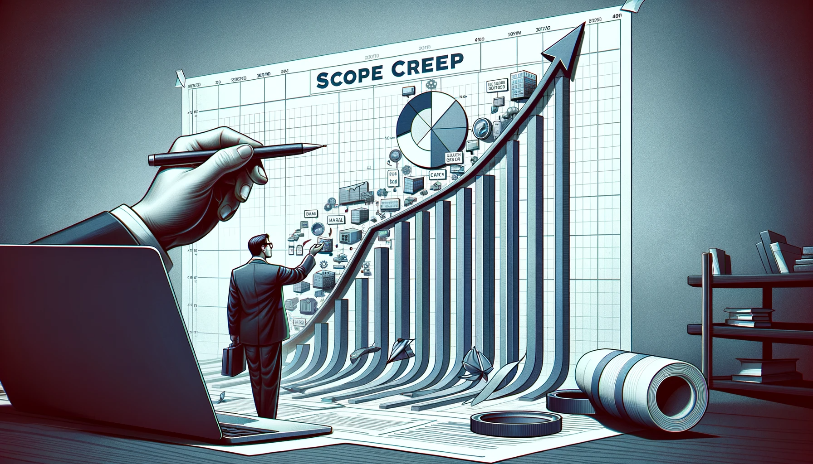

Over a period of more than two years I was part of a fantastic, wild and chaotic journey as a CTO in a startup in the wine and food industry. As in every startup, hope was high and the potential limitless. 

The collapse of the company was not a complete surprise but still a hard fall. This is my attempt to summarize and reflect on some of the things that we did, didn't do, should have done and shouldn't have done. 

In hindsight everything looks easy, but when you're on this roller-coaster startup ride it is really isn't.

### Starting the Journey
In late 2020 I saw an advertisement for a startup CTO job that, based on the description, had to be one of the most exciting roles that I have seen in a long time. It was tech, food and wine wrapped up in a SaaS-solution. I had fun and lengthy discussions with the founder and CEO and eventually applied and got the job. There were so many opportunities to capitalize on multiple groups of customers that it really felt like this could one of the startups that actually make it.

When I started the company had already developed the solution for a couple of years. Several consultancy firms had been tasked with developing and re-developing different phases of the system. This was not clear to me at the time. Sometimes too many different teams being involved is a warning sign, both in terms of overall build quality when code is handed over and one team is not allowed to finalize their work. But also in terms of unclear or changing requirements from the business.

My company suffered from both.

The company lacked clear development processes and the necessary experience to run a tech company. This caused several issues in the product.

* No clear definition of an MVP led to new features added. Some where good and thought through, but many where just to simple and the expected functionality just wasn't there.
* Multiple different customer types, with different needs and expectations, meant a product that did not have a clear problem it solved. It solved too many problems. 
* Requirements changing too much and too often causing stress on the teams working on the product which means problems with quality and not enough time to reflect on how a change affect other parts of the system.
* Over-promising consultants and tight dead lines caused one of the most severe issues with the system, a complete lack of scalability for the most frequently used part of the product.
* No test automation in place causing unnecessary issues in test and production after deployments.

### Assessing the Situation
The plans for the company were ambitious and the forecasts for customer and user growth pointed me to the conclusion that there was no way we could go live with the system without first addressing the performance and scalability issues.

So, the situation was quite far from ideal, yet rather common for a startup operating under those circumstances.

We were now on the fifth team since the company started developing the product and I was committed to making this the last team. It was a small team of 2 developers to start with, way to small for the ambition of the company. But the most pressing issue was to protect the team from all the business discussions, ensuring their ability to work focused and in peace between sprints.

The requirements phase where we discussed back and forth what to do next was in most cases a discussion between CEO, Product Owner and CTO. Together we formed a process for this work that we tried to follow. But to be honest it was still too chaotic. However, when the Epics and User Stories reached the developers they where much more thought through and more detailed than before. 

We started up by fixing the most obvious problem. That our main feature did not scale (at all). We fixed it and reached a new plateau that at the time was acceptable.

We where now ready for go-live we thought. But there where constantly popping up new issues, mostly because quick decisions where made during the implementation of the product but also some completely wrong decisions.

### Scope Creep
One of the issues as I see it was that there was no clear and communicated end-goal where we would have had the sales-ready product. What were the required features to get there? 

There was this 'round the corner' mentality, but every time we finished something and deployed to production a there was a new corner that we had to get to before we could start selling the product. 

This naturally is a warning sign. We should have stopped and gone back to the drawing board. Continuing without a clear path was not a wise thing to do.

The result? Patching and fixing the problems in the system was one thing. This was necessary and also helped the growing team to take responsibility for the entire code base. 

For example, in the past the company had been subject to a few bad recommendations. Such as running a subscription based SaaS service using Shopify, which not at all met the requirements for how the company wanted to handle subscriptions. 

Another one was to move from Microsoft Azure to IBM Cloud. For a global SaaS company with millions of (planned) users I'd prefer AWS or Azure. We later switched back to Azure due to the user forecasts that also made us re-think our architecture. More on that later.

_This is the first blog post in a series of posts where I share some thoughts and lessons learned from my time as CTO for a SaaS startup. [You can find Part 2 here](lessons-from-a-failed-startup-part-2-the-cost-of-scope-creep)_.