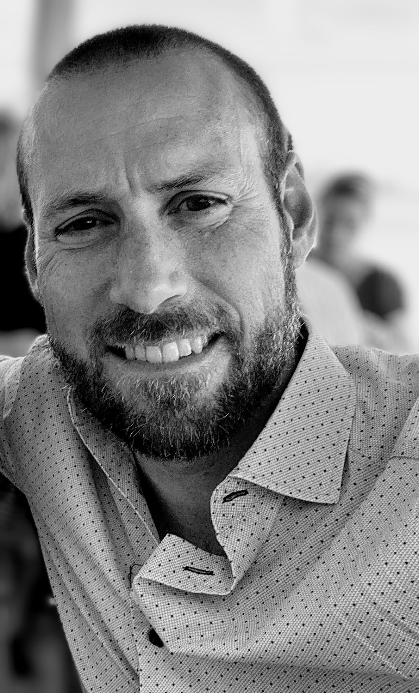

I’m a senior tech leader with over 20 years of experience. I take on leading roles with responsibilities from initial strategies to successful implementation, including setting up governance processes.

I prefer working in an international environment where I can deliver business value with my team. I lead and support development and improvement projects, with on-site and offshore resources. I consider myself hands on and enjoy working with developers and architects to steer technical decisions in the right direction. 

I communicate effortlessly with technical experts as well as with business representatives.

## WORK EXPERIENCE

### Wineally AB —  Chief Technology Officer, 2021 - 2023

As CTO for Wineally my responsibility was to prepare Wineally for global launch. I led my team through a series of critical projects to prepare us for our launch and maturing the product.

I was part of Wineally's management group with responsibility for tech, which was over 50% of the company budget. As CTO I was responsible for tech strategic planning and part of the strategic planning for our business. I reported to the board and communicated with investors.

Key achievements:

* Grew team from 2 to 12 by recruiting a tech team of highly skilled employees and consultants in Sweden and abroad. 
* Increased Wineally's performance and securing our applications
* Migrated from IBM Cloud to Azure and GitHub
* Implemented New Relic as observability platform
* Deployed 100’s of application improvements
* Architecture lift from a monolith to a microservices architecture
* Managing the daily development activities such as daily stand-ups, sprint planning and retrospectives
* Managed requirements for new features and improvements of the platform 
* Creating business and tech strategies for the company
* Reported to CEO and communicated with board members and investors

### INWIDO AB —  Chief IT Architect | Information Security Manager | Data Protection Officer (DPO), 2017- 2021

At Inwido I managed 3 major areas within Group IT and reported to the Director of Group IT.

As Chief Architect I was responsible for the overall IT architecture which include:
* Target architecture landscape, infrastructure architecture, cloud strategy and transition roadmaps 
* Projects to move towards target architectures. 
* Projects for migration from on-prem datacenter to outsourcing partner and public cloud for the Swedish companies in the group.
* Migrations from on-prem Group IT solutions to Azure equivalents

My second role is that of Information Security Manager where I established and executed our information security program to gradually improve the information security posture at Inwido Group. 
* Responsible for security awareness programs and ensuring information security is on the local and group management agenda. 
* Created strategies and delivered projects together with our vendors. 
* Established group policies, standards, audits and created information security services to support our local businesses in areas where there’s a strong business case.
* Complete rewrite of the IT policy to not only include, but heavily lean towards information security in our group policies.

Lastly, my third role was Data Protection Officer (DPO). In this role I 
* Delivered a project and led 10 business unit project managers across Europe to support GDPR. 
* Created a governance structure and plan for continued work and improvements in the privacy area to reduce company risk and improve the privacy of our customers, recruits, and employees

### SONY MOBILE COMMUNICATIONS — Solution Architect Xperia Store, 2014 - 2017

I supported the business stakeholders by leading the continuous improvement of the Sony Mobile eCommerce solution. I coordinated the release of new stores (regions). Led the new design and development implementation and ongoing application management. I also led improvements around SEO (Google Analytics) and performance.

My daily contact and follow up with development-, content- and application management teams in the UK, India and China ensured progress in the project.

### NCC ROADS — Solution Architect | Technical Lead, 2011

Establishing a Service Oriented Architecture.

As a certified SOA instructor, I planned and implemented a new integration architecture following SOA / microservices principles to enable rapid realization of business requirements for new web and mobile applications. 

I created a SOA strategy and governance model. In addition, I also supported the off-shore development team in Riga to work within the new architecture.

### SYSTEMBOLAGET — Lead Developer | Lead Architect, 2009 - 2010

New Web and eCommerce solution.

In this 18 M SEK web and eCommerce project I was lead architect, designing the solution and led the technical team’s day to day work. I supported the project managers with technical and project strategy, worked in close cooperation with the design team as well as customer representatives.

## OTHER WORK EXPERIENCE

2007 - 2010 
Team leader for up to 10 consultants and member of business area           management team (Connecta)

2009 - 2010        
Responsible for business area quality assurance (Connecta)

2012 - 2013
Responsible for business area quality assurance (Forefront Consulting Group)

## ASSIGNMENTS & PROJECTS

### 2021 – 2023 Wineally AB, Chief Technology Officer
Responsible for Wineally’s tech team and SaaS product that we market. 

### 2017 – 2021 Inwido AB, Chief IT Architect, Information Security Manager, Data Protection Officer
Working with strategy, roadmaps, project delivery, policy and standards as well as day to day operations in the areas of application and infrastructure architecture, information and cyber security and privacy compliance (GDPR).

### 2016 - Sony Mobile Communications, Application Management Lead
AM lead for www.sonymobile.com, a multilingual web site. Responsible for application management processes and team efficiency. Ensuring AM delivers value to business and application development teams. Full cloud solution using AWS.

### 2016 - Sony Mobile Communications, Infrastructure move to AWS
Creation of new environment (dev, stage, prod) for Sony Mobiles social platform enabling more suitable infrastructure with reduced cost.

### 2015 - Sony Mobile Communications, Solution Manager
Solution Manager for several different applications such as search platforms, social platforms, blogs. On AWS and on-prem solutions.

### 2014 - 2016 Sony Mobile Communications, Solution Manager
Responsible for solution architecture, requirements, leading outsourced development. Driving change on the eCommerce platform.

### 2014 Nazar Travel, Solution Architect
Responsible for solution architecture and technical requirements for Software Competition leading up to the selection of Nazars next ERP and eCommerce system.

### 2013 NCC Roads, EA Application Domain Manager
Responsible for the application domain roadmaps, strategies, and follow-up.

### 2012 – 2013 NCC Roads, Solution Architect
Solution architect and technological QA for several projects, including ERP and integration projects.

### 2012 – 2013 NCC Roads, SOA Governance and ICC Manager and Expert
Created SOA Governance framework, organization, roles, and responsibilities from scratch. Rolled out the framework and organization as well as ensuring efficient processes.

### 2011 NCC Roads, SOA Strategist and Architect
Created a flexible architecture and transition roadmap for NCC Roads. Step by step build-up of business-case from maturity assessment to SOA strategy. Delivery included architecture, guidelines, roadmap, aligned SOA and IT strategy, maturity assessment, service design and mentoring offshore implementation partner.

### 2011 Trygghetsrådet (TRR), Project Leader
Feasibility study for digitalizing the highly manual application process.

### 2011 Trygghetsrådet (TRR), IT strategy
Together with the CIO at TRR Magnus created TRRs IT strategy for the coming 5 years.

### 2011 ITT W&WW, Architect
Creating a SOA strategy pointing out the strategic goals and KPIs to be able to follow up the initiative. Inventory architecture was also created to set the frames for how services should be designed and implemented at ITT.

### 2009 – 2010 Systembolaget, Lead Architect and Technical Project Leader
1.8-million-euro web and e-commerce (www.systembolaget.se)  project excluding infrastructure and licenses. Solution included complex search functionality, e-Commerce and web.

### 2007 – 2008 Apoteket, System Architect and Integration Architect
Large scale web project (www.apoteket.se) including e-Commerce solution and heavy integration with back-end legacy systems.

### 2006 Stoneridge, Architect and Developer
New intranet based on SharePoint. Developed intranet and mentored Stoneridge personnel.

### 2006 Tradimus, EDI Integration Architect and Developer
EDI solution based on SharePoint and BizTalk Server.

### 2006 Pfizer, System Architect and Developer
Call center sales and support system for presenting targeted offerings to doctors calling in.

### 2005 – 2006 Telenor, Integration Developer
BizTalk Server integration for ordering of data access (ADSL). Internal and third-party external integration.

### 2005 RPM, Financial system, Software Designer and Developer
Batch oriented financial system supporting the core business.

### 2004 Länsförsäkringar, Business Analyst and Mentor
15 applications where to move from outsourced application maintenance to in house. Magnus analyzed the applications and transferred knowledge to customer personnel.

### 2004 AMF Pension, Business Analyst
Formulating vision and presenting suggestions for improving customer communication through traditional mail.

### 2003 – 2004 Länsförsäkringar, Software Designer and Developer
A new web-based vehicle insurance system replacing old AS400 based systems previously used.

### 2002 – 2003 TryggHansa, Developer
Responsible for developing the ledger for a new group insurance system.

### 2001 – 2002 Vårdförbundet, Software Designer and Architect
One of the first systems based on the Microsoft .Net framework. Developed on beta and released just after RTM. A full-fledged member system with ledger and payment matching algorithms was successfully deployed.

### 2000 – 2001 Skandia Liv Finland, Developer
Life insurance system based on a WM-Data product developed using Microsoft technologies.

### 2001 Verket För Högskoleservice (VHS), Rational Suite Implementation
Implementation of the Rational Suite (Rose, Clear Case, Requisite Pro)

### 1998 – 2000 JML Consulting
My own consulting business working with IT from infrastructure to development.

## ROLES
* Chief Technology Officer (CTO)
* Chief Architect 
* Information Security Manager (CISO)
* Data Protection Officer (DPO)
* Solution Architect
* Dev Lead

## LANGUAGES
Swedish 
English

## EDUCATION
MSc Computer Science, Växjö University

## INDUSTRIES
Insurance, Food & Beverage, Retail, Pharmacy